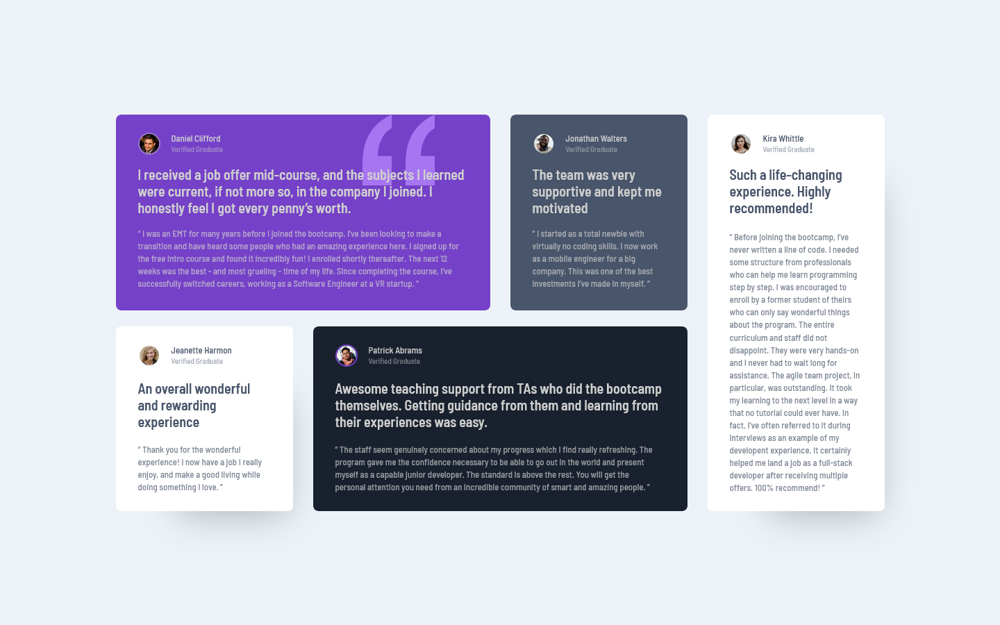

# Frontend Mentor - Testimonials grid section solution

This is a solution to the [Testimonials grid section challenge on Frontend Mentor](https://www.frontendmentor.io/challenges/testimonials-grid-section-Nnw6J7Un7). Frontend Mentor challenges help you improve your coding skills by building realistic projects. 

## Table of contents

- [Overview](#overview)
  - [The challenge](#the-challenge)
  - [Screenshot](#screenshot)
  - [Links](#links)
- [My process](#my-process)
  - [Built with](#built-with)
  - [What I learned](#what-i-learned)
  - [Continued development](#continued-development)
  - [Useful resources](#useful-resources)
- [Author](#author)

## Overview

### The challenge

Users should be able to:

- View the optimal layout for the site depending on their device's screen size

### Screenshot



### Links

- [Solution URL](https://www.frontendmentor.io/solutions/testimonials-grid-vite-react-tailwindcss-hMVEbaZX1l)
- [Live Site URL](https://gorgeous-tarsier-00fdbc.netlify.app/)

## My process

### Built with

- Semantic HTML5 markup
- CSS custom properties
- Flexbox
- CSS Grid
- Mobile-first workflow
- [React](https://reactjs.org/) - JS library
- [TailwindCSS](https://tailwindcss.com/) - CSS utility framework
- [PostCSS]() - CSS preprocessor
- [Vite]() - Module bundler

### What I learned

I learned how to use CSS Grid to layout testimonial cards. It's very convenient to align elements in a 2-dimensional space. Elements are sized by the grid template depending on which row(s) & column(s) it occupies. There's also the `gap` property to define the amount of space between adjacent grid elements. Grids also work well with responsive designs, and TailwindCSS makes it convenient to define & group different grid template and grid occupation properties at different screen breakpoints within the same element.

Within the group of cards, I managed to style only the first one to have a quote SVG in the background. I also discovered that using the `background-position` property was super convenient. It allowed me to first anchor the background image to an edge/a corner of the container. What I didn't know however, is that I could provide a size measurement to offset the image that distance from said edge/corner. TailwindCSS doesn't provide class names out of the box to facilitate that, and instead I had to use arbitrary values to provide the offset I wanted. TailwindCSS abstracted that knowledge away from me and it shows that the framework is not a way to skip learning CSS fundamentals.

I also learned how to setup and use Vite + React with TailwindCSS + PostCSS. React makes it convenient to group chunks of HTML DOM elements into components. From there, it's much easier to manage and change the styling of all cards at once when needed. This is different from HTML, where changing all cards would have to rely a lot more on copy-paste programming, which is a symptom of duplicate code. React helps me define a clear separation of concerns, where all the card styling goes into a component & the data for each card goes into a separate module. Finally, `App.jsx` brings the two modules together and assembles page `<body>` content. 

React also made it convenient to apply a box shadow only to cards with a white background. I could harness the power of JS to compute the resulting class name and keep that logic within the same component:

```jsx
function TestimonialCard({ content, style }) {
  // ...

  const cardShadow = style.backgroundColor === 'bg-white'
    ? 'shadow-[40px_55px_50px_-50px_rgb(0,0,0,0.25)]'
    : 'shadow-none';

  // ...
}
```

### Continued development

I want to learn more about best practices when using React + TailwindCSS. One issue I had was trying to pass in a lot of data into `<TestimonialCard />` component, both for the HTML text content and element styling. I found it challenging to structure that data, especially trying to pass in TailwindCSS class names in full into the component to create each card. On top of that, I had to give the different data representation names, which goes against what TailwindCSS is trying to do to allow productivity boosts.

### Useful resources

- [MDN CSS Docs - `background-position`](https://developer.mozilla.org/en-US/docs/Web/CSS/background-position) - The reference where I learned to offset background images.

## Author

- Frontend Mentor - [@StephenYu2018](https://www.frontendmentor.io/profile/stephenyu2018)
